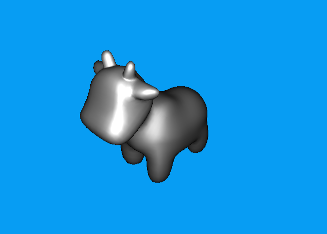
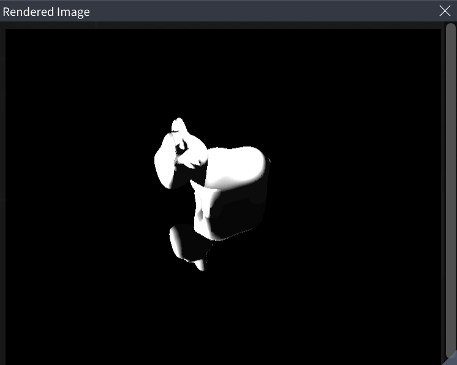

# Computer graphics Renderer

- This project provides relevant method code regarding computer graphics rendering techniques, with only the portions completed by myself included in the project. For the complete code, please refer to [dandelion](https://github.com/XJTU-Graphics/dandelion).

- This project is part of the curriculum design experiments for the Computer Graphics course at Xi'an Jiaotong University.

- Implemented features include: a soft rasterization renderer, Whitted-Style Ray-Tracing

## Description

- A soft renderer completes the entire rendering pipeline on the CPU, generates a framebuffer, and then displays it on the screen. This functionality is primarily implemented in rasterizer.cpp in the project, where the input consists of the spatial coordinates (in triangular mesh form) of a 3D object, and the output is the corresponding rendered image from a given camera position. The input coordinate data first undergoes a series of spatial transformations, followed by perspective-correct interpolation, and finally shading based on the Blinn-Phong lighting model. The rendering result is shown in Fig. 1.

|                                           |
|:--------------------------------------------------------------:| 
|         *Fig 1. Soft rasterization rendering result.*          |

-  Whitted-style ray tracing employs the law of refraction and Fresnel equations to calculate reflection and refraction directions when light rays intersect surfaces of different material types (Reflection / Reflection and Refraction / Diffuse or Glossy). This functionality is primarily implemented in whitted_renderer.cpp within the project. The implementation logic follows these steps: first casting a primary ray and determining whether it intersects with objects, then performing recursive ray tracing. The ray tracing results are shown in Fig. 2.

|                       |
|:------------------------------------------:| 
| *Fig 2. Whitted-style ray tracing result.* |
